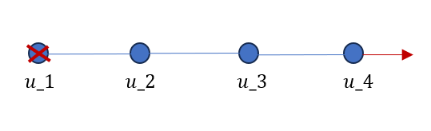

# Элементы 

## Стержневой одномерный конечный элемент
 
В пакете ACELAN-COMPOS реализован одномерный стержневой конечный элемент (```BarElements```). Этот элемент создается по двум узлам, площадь поперечного сечения равна 1/10 длины элемента. Локальная матрица жесткости находится по формуле:
$$  
    K^e =\frac{EA}l\left(
    \begin{array}{cc}
        1 & -1 \\
        -1 & 1 
    \end{array} \right),
$$
где $E$ - жесткость материала, $A$ - площадь поперечного сечения стержня, $l$ - длина стержня.


Реализовано тестирование элемента:

- По двум узлам создается стержневой элемент, строится локальная матрица жесткости.

- Создается модель из 3 стержневых элементов: 
    <!-- panels:start -->
    
    <!-- panels:end -->
    Граница $x=0$ жестко закреплена, при $x=3l$ - прикладывается нагрузка 100 Па. В результате решения задачи для каждого узла получены смещения.  

