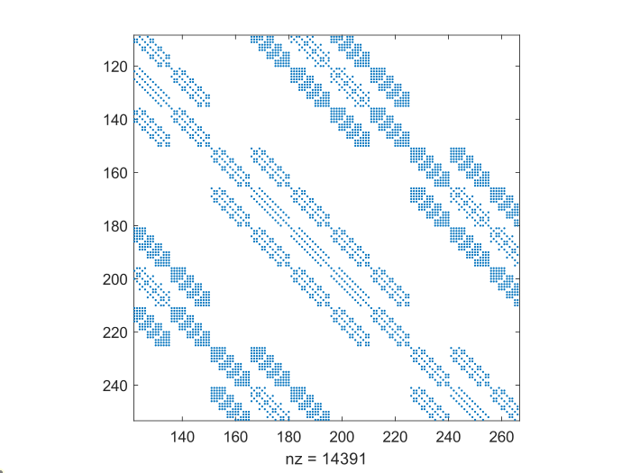
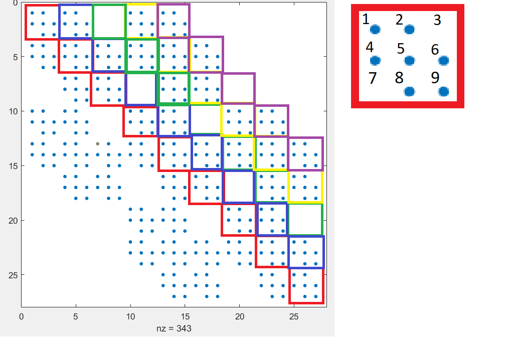
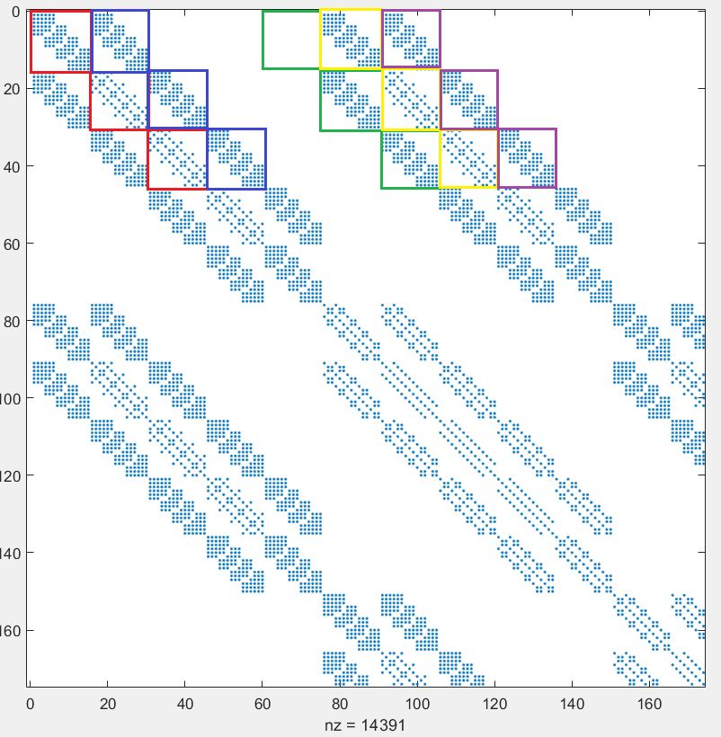
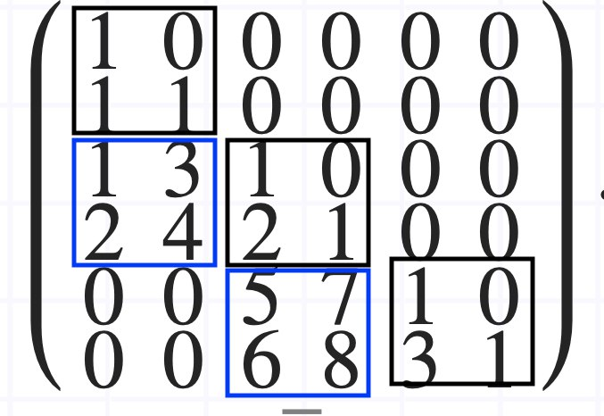

## Выгрузка матриц
Разреженные глобальные матрицы можно получить в различных форматах:

```MatrixBuilder.WriteMatrixTriplets``` выведет матрицу в виде набора триплетов:
```i, j, k```, где `i` - номер строки, `j` - номер столбца, `k` - значение элемента.
Триплеты выводятся только для ненулевых элементов, лежащих в верхнетреугольной матрице.

При решении задачи методом `Model.Solve` можно указать опциональный параметр `exportName`. 
В таком случае в процессе решения в рабочий каталог программы будут записаны следующие отладочные файлы c указанным префиксом:

- _matrix.txt - глобальная матрица задачи
- _matrix_normal.txt -  глобальная матрица задачи после нормировки
- _norm.txt - нормирующий вектор
- _rhs.txt - правая часть
- _rhs_normal.txt - нормированная правая часть
- _solution.txt - решение задачи
- _solution_norm.txt - решение, полученное для нормированной СЛАУ.

Все матрицы выгружаются с учетом граничных условий.

> Не используйте режим экспорта данных вне тестов!

### Блочно-диагональный формат
Для представления матриц в блочно-диагональном формате требуется специальная нумерация узлов,
упорядоченная по каждой координате. Такую переменумерацию легко построить для регулярной 
сетки представительного объема, однако в общем случае она не всегда возможна.
Для перенумерации тривиальным способом на основе положений узлов используется 
метод `Mesh.ReenumByPosition()`

Тестовые скрипты для выгрузки матриц расположены в файле `Acelan.Tests/FemTests/DiagExportTest.cs`
Основная логика реализована в методе 

`ExportDiag(List<Variable> variables, string prefix, string boundaryConditions = null,bool forceBlocks = false)`

Параметры: список переменных в узлах, префикс для имени экспортируемых файлов, набор граничных условий, флаг для построения блочной глобальной матрицы.
Структура матрицы для задачи электростатики характеризуется 9 блочными диагоналями. Структура блоков внутри диагоналей разная:
 
<!-- panels:start -->


 <!-- panels:end -->

Для задачи с 1 неизвестной в каждом узле и регулярной сеткой на основе октодерева состоит из 9 блочных диагоналей.
Так как матрица симметричная, достаточно выгрузить 5 блочных диагоналей. 
Размер блока $s$ для задачи с $n$ переменными и $k$ узлами на ребре куба находится как $s = k*n$.

Координаты крайнего левого верхнего элемента каждой диагонали вычисляются по следующим формулам:

|Номер диагонали |Столбец|
|---|---|
|0| 0|
|1| $s$|
|2| $n*k^2 - s$ |
|3| $n*k^2$ |
|4| $n*k^2 + s$ |

Как видно, часть блоков на диагоналях нулевые. Кроме того, в рассматриваемой задаче внутри блока тоже есть нули.
Разметка диагоналей для задачи с $n = 1, k = 3, s = 3$ представлена на следующем рисунке.



Разметка диагоналей для задачи с $n = 3, k = 5, s = 15$ представлена на следующем рисунке.




Для решения СЛАУ Решателем также проводится разложение трех центральных блочных диагоналей методом Холецкого, после разложения берется нижнетреугольная матрица.

Изпользуется метод sparsecholeskyskyline библиотеки alglib.

Документацию по нему можно найти по ссылке: https://www.alglib.net/translator/man/manual.csharp.html#sub_sparsecholeskyskyline

Матрица после разложения экспортируются в виде 3 массивов:
1. массив элементов главной диагонали (в общем случае не единичный)
2. главной блочной диагонали, находящихся под главной диагональю
3. блочной диагонали, находящейся под главной блочной диагональю (по столбцам)

На рисунке показано как хранятся второй и третий массив.
В этом случае второй массив (-2) будет 1 2 3
Третий массив (-3) будет 1 2 3 4 5 6 7 8


### Структура экспортируемого файла
Экспортируются матрицы в следующем формате:
``` 
<число диагоналей>
<индекс левого верхнего элемента диагонали номер 1>
<элементы верхнетреугольной матрицы блока 1 диагонали 1> <элементы верхнетреугольной матрицы блока 2 диагонали 1> ...
<индекс левого верхнего элемента диагонали номер 2>
<элементы верхнетреугольной матрицы блока 1 диагонали 2> <элементы верхнетреугольной матрицы блока 2 диагонали 2> ...
-1
<первый массив разложения Холецкого>
-2
<второй массив разложения>
-3
<третий массив разложения>
<массив значений правой части>
```
Нумерация элементов внутри блоков представлена на рисунках выше. Все блоки квадратные.

## Консольное приложение для экспорта матрицы

### Установка
По ссылке https://disk.yandex.ru/d/QSiZLpiAdt_zFg находится архив с консольным приложением для генерации тестовых примеров. Эти примеры могут использоваться разработчики решателя.

Инструкция по использованию:
1. Распаковать архив
2. В полученной папке запустить Acelan.DiagExport.exe
3. Ввести запрошенные открывшимся приложением параметры
4. Найти в папке с программой файл DiagData\_{сегодняшний месяц}\_{число}\_{год}\_{час}\_{минута}.txt, например DiagData_08_29_2021_5_16.txt.<br/>
В этот файл были выгружены данные, которые Решатель принимает как входные
5. ???
6. PROFIT

### Использование
При запуске программа просит пользователя ввести 2 параметра:

```Глубина разбиения```

Для решения задачи она рекурсивно разбивает тело на части, формируя из них "сетку".

Пусть мы хотим смоделировать поведение куба с шириной 100см. Тогда Аселан "разрежет" его с каждой из сторон. После разрезания получится 8 кубов по 50см шириной. Далее, Аселан разрежет каждый из получившихся кубов тем же способом.<br/>
В результате каждый из 8 кубов разрежется ещё на 8 кубов с шириной 25см, и общее количество кубов в разбиении станет 64. 
Этот процесс повторяется n раз, где n - заданная пользователем глубина разбиения тела.

Так, если глубина разбиения = 1, произойдёт только одно разрезание. В результате узлов сетки получится 8. Если глубина разбиения = 2, количество узлов сетки будет равно 8*8=64.

Если глубина = n, количество узлов сетки будет равно 8^n.

```Количество переменных```

Число неизвестных в каждом узле сетки, соответствует степеням свободы исходной физической задачи.

Допустимые значения: 1, 3, 4.
