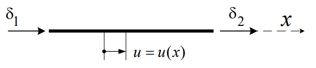
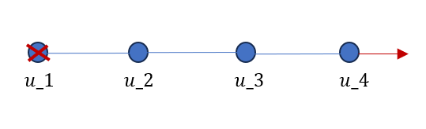
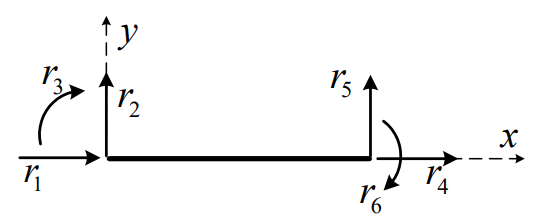
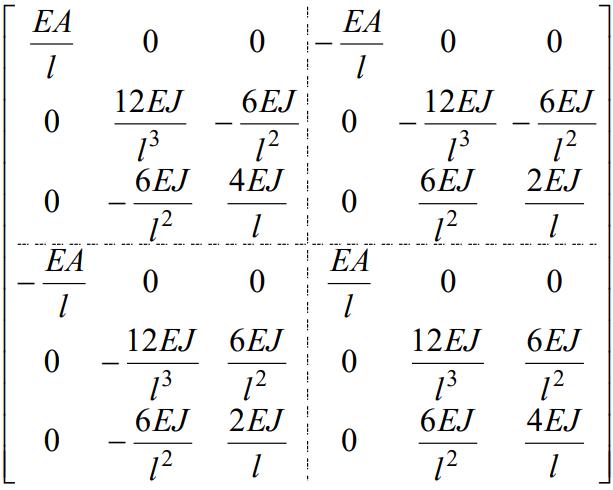
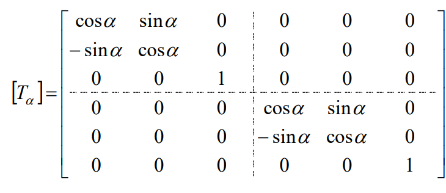
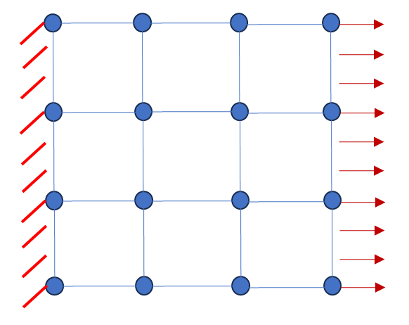
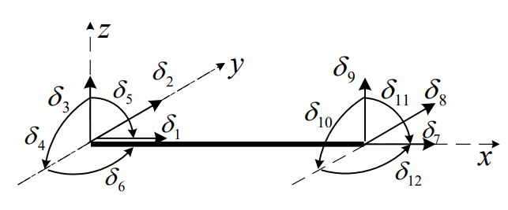
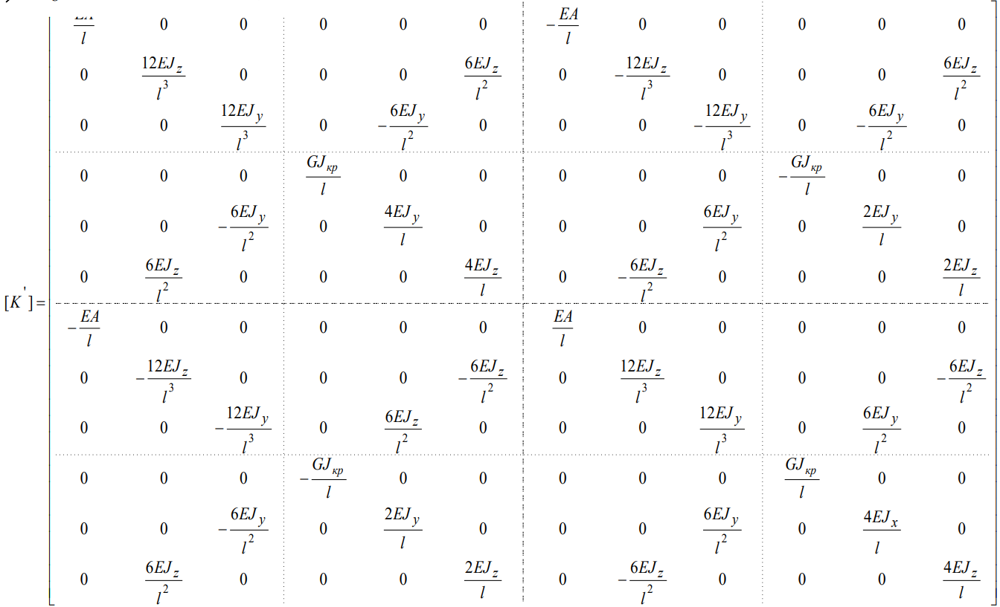
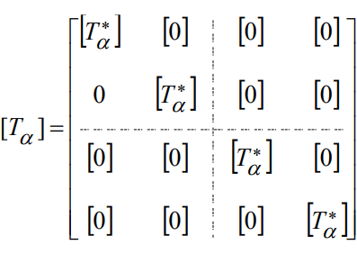
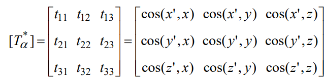

# Стержневые конечные элементы 

## Одномерный стержневой элемент
 
В пакете ACELAN-COMPOS реализован одномерный стержневой конечный элемент (```BarElements```). 
<!-- panels:start -->

<!-- panels:end -->

Элемент создается по двум узлам, площадь поперечного сечения равна 1/10 длины элемента. Локальная матрица жесткости находится по формуле:
$$  
    K^e =\frac{EA}l\left(
    \begin{array}{cc}
        1 & -1 \\
        -1 & 1 
    \end{array} \right),
$$
где $E$ - жесткость материала, $A$ - площадь поперечного сечения стержня, $l$ - длина стержня.


Реализовано тестирование элемента:

- По двум узлам создается стержневой элемент, строится локальная матрица жесткости.

- Создается модель из 3 стержневых элементов: 
    <!-- panels:start -->
    
    <!-- panels:end -->
    Граница $x=0$ жестко закреплена, при $x=3l$ - прикладывается нагрузка 100 Па. В результате решения задачи для каждого узла получены смещения.  

## Двумерный стержневой элемент

В пакете ACELAN-COMPOS реализован двумкрный стержневой конечный элемент (```Bar2Elements```). 
<!-- panels:start -->

<!-- panels:end -->

Элемент создается по двум узлам, площадь поперечного сечения равна 1/10 длины элемента. Для элемента длины $l$ локальная матрица жесткости в локальных координатах определяется матрицей:
<!-- panels:start -->

<!-- panels:end -->
где $EA,EJ$ - продольная и поперечная жесткость стержня.

Для получения матрицы жесткости в глобальных координатах матрица $K'$ умножается на матрицу поворота $T$, где $\alpha$ - угол поворота стержня по отношению к оси $x$ общей системы координат против часовой стрелки.
<!-- panels:start -->

<!-- panels:end -->   

Реализовано тестирование: 
Построена сетка из 24 стержневых элементов.
<!-- panels:start -->

<!-- panels:end -->

Граница $x=0$ жестко закреплена, при $x=3l$ - прикладывается нагрузка 100 Па. В результате решения задачи для каждого узла получены смещения.  

## Трехмерный стержневой элемент

В пакете ACELAN-COMPOS реализован пространственный стержневой конечный элемент (```Bar3Elements```). 
<!-- panels:start -->

<!-- panels:end -->

Элемент создается по двум узлам, площадь поперечного сечения равна 1/10 длины элемента. Для элемента длины $l$ локальная матрица жесткости в локальных координатах определяется матрицей:
<!-- panels:start -->

<!-- panels:end -->
где $EA,EJ$ - продольная и поперечная жесткость стержня.

Для получения матрицы жесткости в глобальных координатах матрица $K'$ умножается на матрицу поворота $T$:
<!-- panels:start -->

<!-- panels:end -->   
где $T_a$ - матрица направляющих косинусов, имеющая вид
<!-- panels:start -->

<!-- panels:end -->   

$$
t_{11}=\frac{l_x}l;
t_{12}=\frac{l_y}l;
t_{13}=\frac{l_z}l;
$$

$$
t_{33}=\sqrt{\frac{1-t_{13}^2}{1+tg^2{\alpha}}};
t_{23}=t_{33}tg{\alpha};
$$

$$
t_{21}=-\frac{t_{11}t_{13}t_{23}+t_{12}t_{33}}{t_{11}^2+t_{12}^2}; 
t_{22}=\frac{t_{11}t_{33}-t_{12}t_{13}t_{23}}{t_{11}^2+t_{12}^2}; 
$$

$$
t_{31}=t_{12}t_{23}-t_{22}t_{13};
t_{32}=t_{21}t_{13}-t_{11}t_{23}.
$$