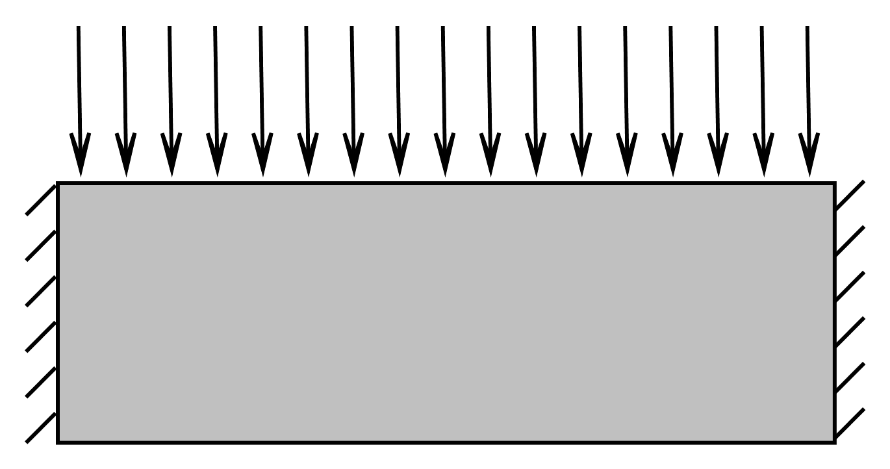

## Топологическая оптимизация в пакете COMSOL

Топологическая оптимизация – это математический подход, который служит для
поиска наилучшего распределения материала в ограниченных пределах пространства
при заданных условиях. Результатом топологической оптимизации является сложная
структура, на основе которой формируется геометрическая модель детали для дальнейшего
производства. В модуле оптимизации пакета COMSOL реализован функционал топологической 
оптимизации, который упрощает настройку задач.
Функционал основан на методе распределения плотности, в рамках которого параметр 
распределения материала задается с помощью управляющих параметров через 
интерполяционную функцию.[1]

Рассмотрим оптимизацию топологии балки, к верхней грани которой приложена
распределенная нагрузка, а боковые грани жестко закреплены.



1. Создаем модель, которую будем оптимизировать (строим геометрию модели, добавляем материал (Structural steel), 
   задаем граничные условия и нагрузки, строим сетку, решаем статическую задачу)

2. Топологическая оптимизация модели. В разделе Definitions добавляем переменную `E_SIMP=dtopo1.theta_p*200e9`,
   200e9 Pa - модуль Юнга для нашего материала, ```dtopo1.theta_p``` - значение
   относительной плотности, рассчитанное в модуле Density Model.
   
3. В раздел Definitions добавляем узел ```Topology Optimization/Density Model```
   (модель распределенной плотности). Указываем область, в которой будет использована эта модель
   для проведения топологической оптимизации.
   Включаем фильтр Гельмгольца, который используется для сглаживания распределения полевой
   переменной. В качестве параметра фильтра $R_{min}$ по умолчанию используется минимальный
   размер элемента сетки ($h$).

   $$\theta_f=R_{min}^2\nabla^2\theta_f+\theta_c$$

   Выбираем способ интерполяции (используем SIMP).
   Задаем начальное значение относительной плотности (оставляем 0,5).
   
4. В Solid Mechanics добавляем узел Linear Elastic Material и выбираем оптимизируемую область.
   Задаем распределение модуля Юнга ```E_SIMP```.
   
5. Решаем стационарную задачу. Добавляем узел Optimization, в котором
   выбираем алгоритм решения оптимизационной задачи (MMA - метод движущихся асимптот), задаем требуемую точность и
   максимальное количество итераций. Добавляем функцию минимизации полной энергии
   упругой деформации.

6. Для того чтобы график отображался в процессе расчета и мы могли видеть процесс оптимизации
   создадим 2D Plot Group, на котором будем отображать перемещение. Для отображения только той области, которая занята
   материалом, добавим узел Filter с условием ```dtopo1.theta>=0.5```.

7. Для того чтобы в дальнейшем можно было экспортировать данные добавим график Contur, в котором
   построим изолинию вдоль которой переменная ```dtopo1.theta``` принимает значение 0.5.
   
   ####Результаты оптимизации балки в пакете COMSOL
   


[1] - https://www.comsol.ru/video/topology-optimization-with-comsol-webinar-ru?ysclid=ldcx2iibhm167962911